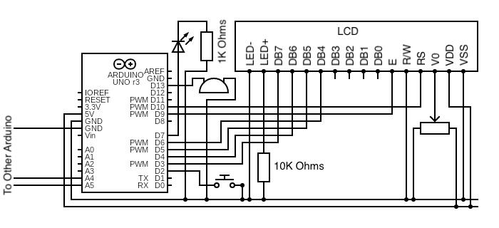

# Automatically Watering a Plant

 *Jake Andrews, Jem Clift, Joshua Peachey, Matthew Snell*

> A report (4 to 5 pages) which explains your motivation, process and implementation.
> Report must be in PDF format.

### Introduction

> An introduction to the problem area that you have identified. You should indicate your
> motivation for selecting this problem area. (approx ½ page)

University students love to decorate their rooms with plants as it makes their room feel more homely. Some students opt for fake plants but real ones give life to a room with the downside of requiring some care.

Unfortunately, as most university students do not live in their university accommodation all year round, they often leave their plants unattended unable to water them. Students are also busy so can often forget to water their plants.

In addition a lot of people even struggle to properly take care of their plants even when they are around as during their busy lives they often forget to water them. 

Most plants require regular watering and will wilt and eventually die if neglected.

>  **"When plants are not watered properly they wilt."- Luiz de Queiroz College of Agriculture**

To solve this problem, our project is a plant irrigation system that automatically waters a plant when its soil is too dry. It also monitors other important values like light and temperature and all this data is displayed on a remote arduino with an LCD that can be placed on your desk. If the plants soil is too dry, it is too hot or cold, a warning is displayed with a buzzer tone and flashing LED to warn the plants owner.

### Literature & Technology Review

> A literature and technology review. This should help provide evidence for your chosen
> problem area and justification for your development decisions. (approx ½ - 1 page)
> 

To create an effective irrigation system we researched a few factors including optimal temperature, light and water for indoor plants. 

Light is the most important factor for growing plants. We decided it was therefore crucial to include a light sensor to give the plant owner an indication of how much light there is where the plant is located. The amount of light is quickly visible on the display. As opposed to managing the amount of light the plant receives, the light sensor is more of a tool to help the grower assess and optimise the location of their plant.

Temperature is the second most important factor influencing plant growth. We identified 15°C-25°C to be a healthy range for growing indoor plants. Temperatures outside this range for excessive amounts of time may lead to stunted growth or even death. Our solution provides an up to date accurate temperature on the display and also a warning to alert the grower to suboptimal or dangerous temperatures. Making this valuable information so visible really helps the grower to ensure their plant has the best chance of being healthy. 

Water is the only factor out of the 3 which can't be set and left. Improper watering causes problems and will affect the growth of the plant. 
> "Feel the soil by pushing a finger an inch or so below the surface. If the soil is still moist, no further water is needed."

We used this simple principle when creating the automatic system. If the soil is dry then water until the soil is moist.

V. Pennisi, B., 2006. Growing Indoor Plants with Success | UGA Cooperative Extension. [online] Extension.uga.edu. Available at: <https://extension.uga.edu/publications/detail.html?number=B1318&title=Growing%20Indoor%20Plants%20with%20Success#water> 

W. D., H., 1945. [online] Scholars.unh.edu. Available at: <https://scholars.unh.edu/cgi/viewcontent.cgi?article=1320&context=agbulletin>

### Development Process

> An overview of the development process - what you did, how you did it, what additional
> research you conducted, any problems you encountered and how you overcame
> these. (approx 1 page)

#### Overview

**Survey**
In order to research the problem in more depth. We conducted a survey asking asking university of Bath students who owned plants, "Would you be interested in using an automatic plant irrigator and why?"

In total we asked 28 people. Of these 28 people 27 said "yes" and 1 said "no".

Here are examples of some of the responses we received:

"No, I as I often enjoy watering and taken care of the plants myself. Also, as I do not live very far away from university it means i can easily take the plant home with me while I am on holiday away from university."
"yes, because I am too busy to water all my plants."
"yeah, I forget all the time."
"yeah, My chilli plant is almost dead so it would be very useful."
"yes, because I won't be here over Christmas to water them."
"yeah, because I either water them too much or too little and then they die."
"yes, as the only reason I haven't bought a plant for my room was because i was 

This survey turned out to be very useful as  informed us that there was a very high demand for our product with only one person saying they wouldn't be interested.

**millis() VS delay()**

Originally the first version of our project used the `delay()` function to limit sensor readings. There were a few problems with this approach. If one sensor needs to be checked more frequently than another, for example the light and temperature are checked very frequently to update the display, then larger delays for longer wait sensor readings cannot be used. This is because the `delay()` function almost completely pauses the board. The solution to this problem is to use the `millis()` function instead. `millis()` returns the milliseconds that the arduino has been running a program for. This can be used to check if enough time has passed to run an event and then set the next time to run that event. This way multiple "delays" can run simultaneously.

**Warnings**

If you have a warning system and a way to dismiss a warning you will have to deal with the problem of when to next allow the same warning. Although we could have used a timer to dismiss a warning for some amount of time, we decided to reset the ability for a warning type to alert the user when it's value returns to a normal range. This way if a user dismisses, for example, a to hot warning, they will next be alerted when the temperature returns to normal before rising again. We used a boolean array `canBeWarning` which tell the program whether a specific type of warning is currently allowed. Warnings also automatically dismiss themselves if sensor readings return to normal.

**Communication**

Our system has a master board and a slave board. The master is responsible for gathering data such as the temperature and humidity and then sending it to the slave board which is responsible for displaying that data and any warnings if deemed necessary. When the master board gathers data from any of its sensors the function `sendToSlave()` gets called which creates a wire transaction, packages the data into a byte array and then executes the transaction. The slave board then unpacks this data and checks if any of the new values are extreme enough to warrant an alarm. Once the data has been processed the slave will then update the LCD display with the new data.

**Watering**

In order to water the plant we first collected a sample of dirt which we deemed to be appropriately moist. We deemed the soil as moist using a technique we came across in our research above "Feel the soil by pushing a finger an inch or so below the surface. If the soil is still moist, no further water is needed." We then used our soil moisture sensor to read how moist this sample of soil was (53%). In order for our watering system to keep the soil moisture at this level. Every 30 minutes the arduino will use the soil moisture sensor to take 10 readings of how moist the soil is and then calculate the average of these readings. If the average is below 50% then the pump will turn on for 2 seconds and pump a small amount of water through a tube which is then placed in the soil of the plant. The reason for the averaging is that the sensor can sometimes produce incorrect values that may cause the plant to get overwatered. In addition, if for any reason the user wanted to water the plant manually. we implemented a button that the user could press which would pump water into the plant for as long as it is pressed down.

**Updating LCD**

Every 10 minutes the master board will send the slave arduino the current Temperature, Light exposure and Soil Moisture percentage so that it can be presented on the LCD screen.

#### Additional research

- How dry should the soil be to warrant watering
- How far is typical plant from student in a room (length of wires connecting both arduinos)
- Types of pump (obviously we ended up with submergible)
- Our soil moisture sensors and the better capacitive soil moisture sensor

 ### Final Prototype Implementation

> Description of your final prototype implementation - provide a description of the
> components used in the final prototype and how these interact with one another in your
> system. (approx ½ - 1 page)

**Watering**

A transistor was used to power the pump. The emitter was connected a source of 5V, The collector was connected straight to the ground, The base was connected to pin 3 and was in series with a 10k Ohm resistor. This meant that in order to water the arduino you would just need to send a voltage through pin 3.

#### Description
One Arduino Uno is placed at the plant and the other is intended to display information and warnings about the plant so can be placed on a desk or somewhere insight of the user. The boards are connected by 3 Wires which can be long enough to place the master and display far apart in a room.

The plant board has sensors to measure soil moisture, temperature and light. It also has a submersible pump (placed in any water container) and a button to manually water the plant.

The display board has an LCD to display sensor data and warnings. It also has a potentiometer to vary the LCD contrast, a button to dismiss warnings, and a LED and buzzer to alert the user of warnings.

#### Components

2 x Arduino Uno and 3 x 1m wires to connect them

**Master Board**

- Soil Moisture Sensor
- Small Submergible Pump
- Temperature Sensor
- Phototransistor
- Resistors (2 x 1K Ohms, 10K Ohms)
- BC548 Transistor
- Button
- Jumper Wires

**Display Board**

- 16 Column 2 Row LCD
- Button
- Piezo Buzzer
- Resistors (2 x 1K Ohms)
- Red LED
- Potentiometer
- Jumper Wires

### Summary & Conclusions

> Short summary and conclusions (approx ½ page)

Overall we deemed this project as a great success. It ended up functioning exactly how we wanted it to and it performed well in all of our tests. It was able to successfully measure the moisture level of soil and water it if it were too dry. In addition, the screen managed to function successfully reporting to the user the temperature, and the amount of light the plant was receiving. The alarm systems were also a great success as they acted as a great warning system whenever the plant was too dry or hot. However, we also thought of some improvements that we would have made if we wanted to sell and distribute this product. These were:

- We would use a better soil moisture sensor. This is because the sensor we use degrades over time and can actually poision any plants or even kill them if the sensor is used over a prolonged period of time.
- We could have also used a larger tank of water rather than a cup. This would mean that the plant can be left unattended for a longer period of time without needing to refill the tank of water.
- We could also add more sensors and devices that would help to keep the plant healthy. For example, we could add a humidity sensor along with a dehumidifier. This would be ideal for a commercial product as there are many factors that need to be considered to keep a plant alive whilst unattended.
- It would have also been benificial to have more testing time to allow us to fine tune the watering system. We could have also then developed a more complex system that would chose an appropriate moisture level for different types of plants.
- The current averaging method used to remove erroneous readings doesn't always provide an accurate representation of the current moisture level as it spreads the readings across the delay interval. Instead of this it may be more suitable to take multiple readings in quick succession and remove outliers there as this will give an accurate representation of the current moisture level at the time of the reading.

### Appendix

> Please add an appendix (as an additional page to the report) which shows a clear
> photo of your solution. Extra marks will be given for the inclusion of a schematic of your
> solution, which can also be included in the appendix. You can use schematic drawing
> tools such as Autodesk Eagle (free for students) or Frtizing (not free). Alternatively you
> may choose to draw this on paper and upload a picture or similar. This appendix should
> not take more than 1 page.

**Display Board Schematic**

**Master Board Schematic**

