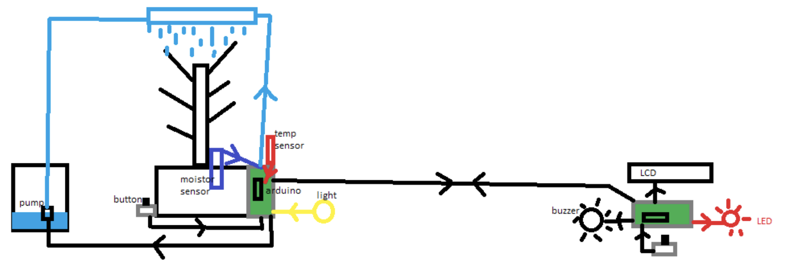

# Arduino Coursework Group 23 (Wet-Arduino)

> 25/11/21

### Problem

University students love to decorate their rooms with plants as it makes their room feel more homely. Unfortunately, as most university students do not live in their university accommodation all year round, they often leave their plants unattended, unable to water them causing the plants to wilt and eventually die.  

Our project is a plant irrigation system that automatically waters plants when their soil is too dry as well as monitoring other important values like light and temperature.

### Plan

*Your system must consist of the following functionality and features:*  

- *Use a minimum of 2 Arduinos that must communicate in a meaningful way.  Include*
- *minimum of 3 unique inputs (buttons, potentiometers, sensors etc)*
- *Include a minimum of 2 outputs (serial monitor, LCD, LEDs, servo etc)*

Inputs:

- Temp
- Light
- Soil moisture
- Button
- Potentiometer

Outputs:

- LCD
- Buzzer
- Pump
- LED

**Matt:**

- Temp
- Light

**Jem:**

- LCD Display
- Buzzer, Led

**Jake:**

- Board comms

**Josh:**

- Pump
- Soil moisture
